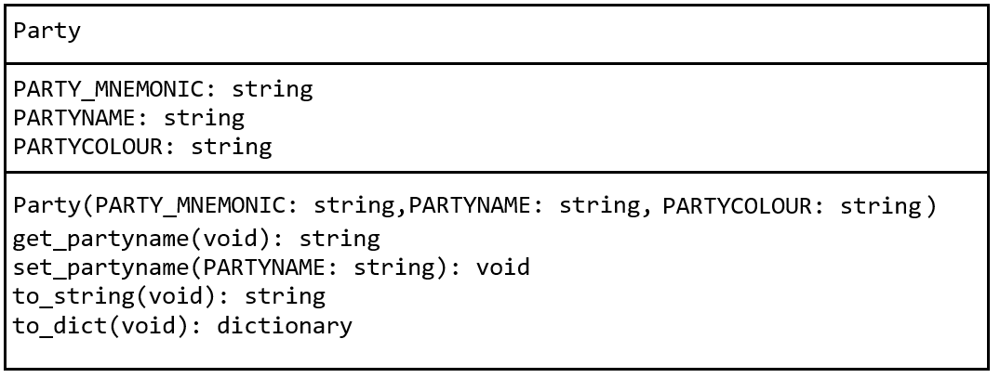

# Assignment 4 - IRL Election

## Setup

Create a new project folder called `a4`.  You will need to add the contents of [this](a4.zip) ZIP file into your project.

Do not modify the content in the `.json` files unless instructed to do so.

## Q1 - Parties

1.  Provide the code in the Python program `1_parties.py` to print each party name and the number of parties as shown in demo video [0.00].

1.  Provide the code in `1_findParty.py` to allow the user to enter a PARTY MNEMONIC and then show party name.  See the demo video [0.05].

1.  Provide the code in `Party.py` that implements the `Party` class as shown in the class diagram.

    

2.  Test you've implemented the `party` class correctly by running `1_PartyTester.py`.  See the demo video [0.22].

3.  Provide the code in `1_partyObjects.py` to read each party from `parties.json`, create a party object and print a string representation of each party object.  See the demo video [0.27].

4.  Provide the code in `1_partyUpdate.py` to update a given party name and write update to `parties.json`.  You must use the `Party` class function `set_party_name()` in your solution.  See the demo video [0.31].

## Q2 - Stats

1.  Provide the code in the Python program `2_regions.py` to get print a "menu" of regions read from the `regions.json` file. See the demo video [1.01].

3.  Provide the code in `2_constituenciesByRegion.py` to allow the user to select a region and then show the constituency names for that region.  See the demo video [1.09].

4.  Provide the code in `2_stats.py` to print overall election statistics.  See the demo video [1.19].

## Submission Details

The deadline for electronic submissions is **End of Day Friday 18th April 2025**. Submit your code via the link on BlackBoard.

Submit your Assignment Cover Sheet during any lab before the end of semester.

### A note on plagiarism and cheating

If any of the code submitted by you is deemed copied from or by someone else it will be formally reported to the Head of School of Science and a Disciplinary Committee will be convened to deal with this issue. You do not want that to happen!!

Never copy code from someone else or another source. Never give your code to someone else. Do NOT use any Generative AI tool for any part of this assessment.  Only use code demonstrated in module content.  

Keep your code safely in your own possession. Plagiarism and cheating are very serious academic offenses with serious consequences for your future academic studies and work opportunities. Under current guidelines all students involved in plagiarism or cheating must be reported to the Head of School where a Disciplinary Committee will deal with the issue.

If any of the code submitted by you is deemed copied from or by someone else it will be formally reported to the Head of School of Science and a Disciplinary Committee will be convened to deal with this issue. You do not want that to happen!!

Final grades are subject to a code review of your solutions.  A code review will include checks for the following:  
- readability 
- duplication of code 
- variable naming 
- code performance 
- authenticity 
- etc. 
