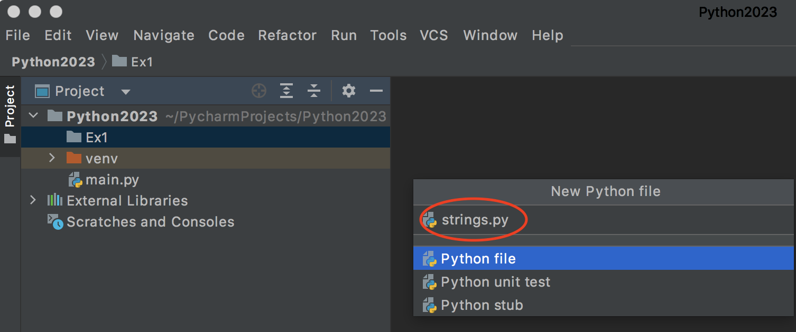

# Python Exercise 1

# Lab #1
## Part 1 — Setup

You should save all your module programs into ONE consistent folder location e.g. an external hard drive.

On your external hard drive create a new folder called `python` in the root level folder.  This is where you'll save all your Python project code.


## Part 2 — Hello World

1. Run the PyCharm IDE on your PC
2. Create a *New Project* called `HelloWorld` in your main `python` folder.
3. Type the code below into the `main.py` program file:
   ```python
   print("hello, world!")
   ```
4. Execute the code by pressing <kbd>Shift</kbd> + <kbd>F10</kbd> or `Run 'main'` button :arrow_forward:

# Lab #2

## Part 3 - Practical Exercises

Let's create a new project that will store the code for all our weekly exercises.  Within this one project we will save all our programs into folders/directories.

1. Run the PyCharm IDE
1. Create a *New Project* called `Python2024` in your main `python` folder.
1. Create a new project folder called `Ex1` -  (<kbd>File</kbd> ... <kbd>New...</kbd> ... <kbd>Directory</kbd>):
   

For each weekly exercise create a new project folder.  Next week you'll create a folder called `Ex2`.


## Part 4 - Strings

In your `Ex1` folder create a new *Python file* called `strings.py`



Paste the following code into your new `strings.py`:

```python
sentence = "The quick brown fox jumps over the lazy dog"
first_name = "Mary"
last_name = "Anning"

# print the sentence - The quick brown fox jumps over the lazy dog
print(sentence)

# get length of the sentence - 43


# print first character of the sentence - T


# print last character sentence - g


# print the word fox from the sentence - fox


# using the string concatenation operator + print Mary Anning


# using a format string print Mary Anning


# using a format string print 2 * 10 = 20


# print the sentence in all lower case - the quick brown fox jumps over the lazy dog


# print the sentence in all upper case - THE QUICK BROWN FOX JUMPS OVER THE LAZY DOG


# find and print the index position in sentence where word dog appears - 40


# replace the word dog with cat & print the sentence - the quick brown fox jumps over the lazy cat


# change and print the sentence so "cat" permanently replaces "dog"  - the quick brown fox jumps over the lazy cat
```

Provide the missing code in each section.  When completed the program should print this:

```
The quick brown fox jumps over the lazy dog
43
T
g
fox
Mary Anning
Mary Anning
2 * 10 = 20
the quick brown fox jumps over the lazy dog
THE QUICK BROWN FOX JUMPS OVER THE LAZY DOG
40
The quick brown fox jumps over the lazy cat
The quick brown fox jumps over the lazy cat
```


## Part 5 - Numbers

In your `Ex1` folder create a new *Python file* called `numbers.py`

Paste the following code into your new `numbers.py`:

```python
x = 12
y = 4

# print x + y
print(x+y)

# print x - y

# print x * y

# print x / y

# print x % y

# use a format string to print 12 + 4 = 16

```


## Part 6 - Input

In your `Ex1` folder create a new *Python file* called `inputs.py`

1. Write code to ask the user to type his/her name and then print hello \<name>\.  e.g.:
   
   ```
   Enter your name:Bob
   Hello Bob
   ```

   *You may comment out code above when done before doing next exercise below* 

   ```python
   # this is a comment in Python
   ```

1. Write code to ask the user to type his/her first and last name and then print the full name.  e.g.:
   
   ```
   Enter your first name:Bob
   Enter your last name:Marley
   Hello Bob Marley
   ```

1. Write code to ask the user to type a number and you will print the double of the number given. e.g.

   ```
   Enter a number:5
   Double of 5 is 10
   ```

1. Write code to ask the user to type 2 numbers and you will add both numbers. e.g.

   ```
   Enter number 1:5
   Enter number 2:10
   5 + 10 = 15
   ```


